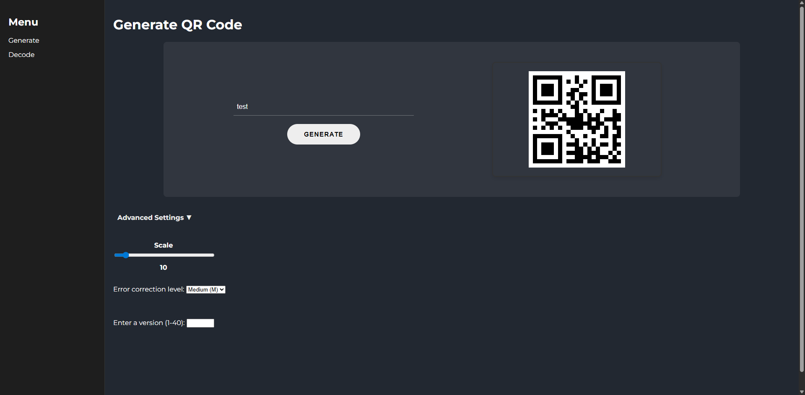
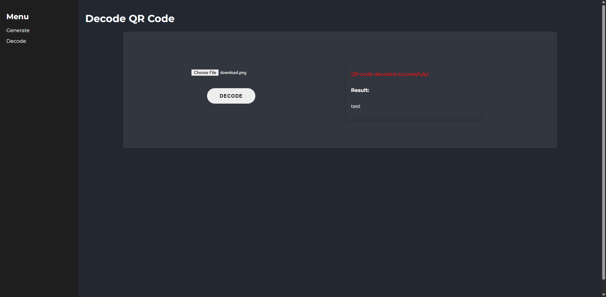

# Node.js QR Code Generator & Decoder Web App

A simple and modern web application built with Node.js that allows users to **generate** and **decode** QR codes from images or text. Perfect for quick testing, or for personal use.

## Screenshots




## Features

- ✅ Generate QR codes from any text or URL
- ✅ Decode QR codes from uploaded images
- ✅ Customize QR code output:
  - Adjust image **scale/size** (1-100)
  - Select **error correction level** (L, M, Q, H)
  - Select **QR code version** (1–40)
- ✅ Fast and clean user interface
- ✅ Built with Express.js

## Built With

- **Backend**: Node.js, Express.js
- **Frontend**: HTML, CSS, JavaScript
- **QR Code Generation**: `qrcode` npm package
- **QR Code Decoding**: `jsqr` npm package

## Setup

### Prerequisites

- Node.js (v14 or later)
- npm

### Installation

```bash
git clone https://github.com/davidszatmari/QRCodeWebsite.git
cd QRCodeWebsite
npm install
```

### Running the App

```bash
npm start
```

## API Usage

### Generate QR Code

**Endpoint:**  
`POST /generate`

**Request Body (JSON):**

| Parameter                          | Type   | Description                                    |
| ---------------------------------- | ------ | ---------------------------------------------- |
| `text` (required)                  | string | The text or URL to encode in the QR code.      |
| `input_scale` (optional)           | number | Scale/size of the QR code image.               |
| `input_errorCorrection` (optional) | string | Error correction level: `L`, `M`, `Q`, or `H`. |
| `input_version` (optional)         | number | QR code version (1–40).                        |

**Example using HTTPie:**

```bash
http POST http://localhost:3000/generate text=test input_scale=5 input_errorCorrection=H input_version=8
```

### Decode QR Code

**Endpoint:**
`POST /decodeqr`

**Request:**  
Send a multipart/form-data request with a file field named `qrImage`.

**Example using HTTPie:**

```bash
 http -f POST http://localhost:3000/decodeqr qrImage@download.png
```

**Response (JSON):**

```json
{
  "decodedText": "test"
}
```
